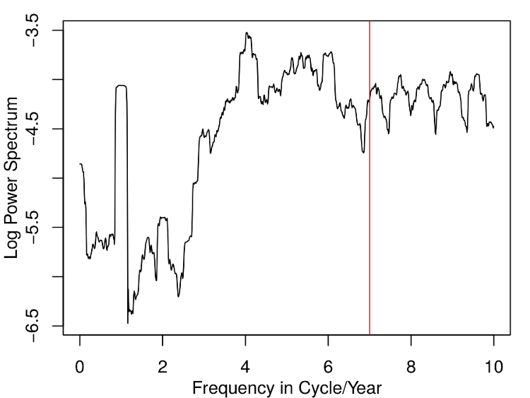
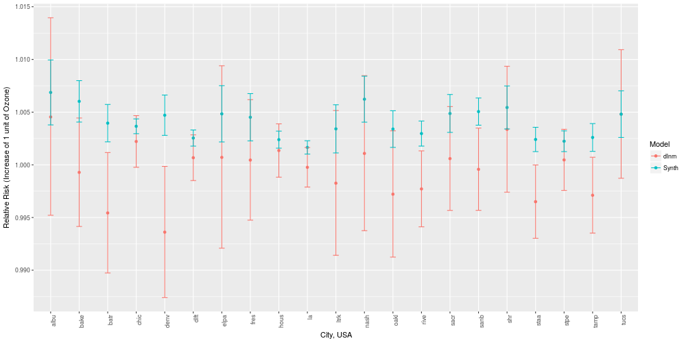

## Some Context {.fullslide}
<center>


## Mechanism

- Ambient exposure triggers physiological symptoms
 - Morbidity (hospitalizations, health conditions) and Mortality (premature death due to physiological causes)
- Not just extreme events: there appears to be no "safe" lower limit
- Air pollution $\longrightarrow$ public health

## General form of single-lag model

The traditional approach in the field uses a log-linear Generalized
Additive Model to obtain the estimated pollution log-relative-rate $\beta$ for
pollutant $\mathbf{x}$, 

$$\begin{split}
\log (\mu) &= \beta \mathbf{x} + \gamma_1 \text{DOW} + S_1 (\text{time},7/\text{year}) \\
&+ S_2(\text{temp},3) + \cdots \\
\end{split}
$$
with various confounding terms such as temperature (mean daily), day-of-week (DOW, as factor), 
and time. In R using the **gam** package, we might estimate such a model via
```{r, eval = FALSE}
mod <- gam(y ~ x + dow + ns(time, df = 7) + ns(temp, df = 3), family = poisson, 
           data = my_data)
```

## Embedding within Other Research

* Hwashin gave the context from the Health Canada point-of-view, along with some of
our current (unfinished) research - multiple pollutants, multiple responses, and associated issues
* Justin will explore some technical concerns within the synthetic lag algorithm
* Dave's transfer function work is being applied to some of these concerns as well

## The Genesis: Smooth Functions of Time

Why Spectral Methods?

<br>
... to protect [the estimate] from confounding by
longer-term trends ... and to account for any additional
temporal variation ... we partial out the smooth
fluctuations in the mortality over time
(Dominici, Samet and Zeger, JRSS-A, 2000)

<br>
... the smooth function of time serves as a linear filter
on the mortality and pollution series and removes any
seasonal or long-term trends in the data
(Peng, Dominici and Louis, JRSS-A, 2006)

<br>
**Implied**: the smooth function of time is effective at removing
low-frequency (long timescale) variation in both mortality and
pollution.

## An Example of Cubic Regression Spline Filtering {.fullslide}

<center>

</center>

## An Example of Cubic Regression Spline Filtering

As will be obvious to anyone who uses filters regularly, the splines
used act as a **linear filter** on the response. More
specifically, the splines act as a linear filter on the response and
all predictors (due to the algorithm used in GAM estimation).

<br>
However, also as is clear from the previous ...

<center>
**The filtering is not particularly well done!**
</center>

## Slepians as Smoothers {.fullslide}

<center>

</center>

## Summary and Results

* thinking of the problem "spectrally" gives great intuition
* allows for simple improvement of models
* bias protection, robustness of estimation (to assumptions)
* opened the door to these models being improved

## Topic 1: Distributed Lag

A second common approach to modeling the population health impacts of air pollution
uses **distributed-lag**, **distributed-lag non-linear**, or even **distributed-lag non-linear penalized** models  to estimate association over multiple lags. 

Simple distributed lag model:
$$
y_t = a + w_o x_t + w_1 x_{t-1} + \cdots + w_n x_{t-n} + \epsilon_t.
$$

Distributed-lag non-linear model:
$$
y_t = \mathbf{w}_{t\cdot}^T \mathbf{\eta} + \epsilon_t.
$$
and so on for penalization. Typically, we would embed one or more DLNM (penalized or not) components into the single-lag, single-pollutant GAM or GLM framework. 

## Constraints

- The approach is coarse, with resolution of one day at best, 
due to health data recording constraints
- Multicollinearity forces the placing of some predetermined structure upon the lags
- Model selection within the framework remains somewhat of an open question, although good results appear to arise from using AIC selection

## Toronto, Ontario: 1984-2012 {.fullslide}

<center>


## Synthetic lag

A **portion** of the association obtained by the fitting of the residual effective
predictor and response, after accounting for other confounders and the smooth function
of time, is actually driven by ***coherence between short timescale line components***
present in both the predictor and response.

<par><center>
This opens the door to a different formulation.

## Synthetic lag, continued

Instead of considering the association as point regression on discrete, day-sized chunks of
data, or constrained sets of the same (e.g., DLNM), consider instead a **continuous** relationship between the predictor (health effect) and 
response (air pollutant). The data consists of:

- Daily counts of health effect occurrences (mortality, hospitalization, etc.)
- Daily metric of air pollution to match (24-hour mean, maximum 8-hour average, etc.)

## Algorithm framework

- Estimate MTM spectra for both predictor and response
- Estimate coherence between the two; identify periodic structure relationships
- Estimate phase 
- **Align** the phase of the individual periodicities in the predictor to the phase of the response
- Invert phase-aligned pollutant spectra back to time domain
- Model using classical single-pollutant frameworks

## Optimal Phase and Frequency Estimation

It remains an open question as to how best model the phase and amplitude of structural components in a stationary (locally stationary?) time series.

- Harmonic F-test to detect lines
- Bandwidth selection question
- Non-independence of samples within bands
- One aspect of this problem was Justin's MSc project, which he'll talk about in a bit

## Associations: Chicago (1987-2000), NMMAPS {.fullslide}

<center>


## Some (Possibly Unfair) Comparisons

The following two slides can be considered to be unfair:

- The DLNM model fits shown are for a specific maximum lag (15), specific spline structure (4 df), and have not been optimized (by city or application)
 
However, a similar thing could be said for the synthetic lag approach:

- The synthetic lag parameters have similarly been set to 95\% significance for component detection, default average phase estimation, and lag-0 baseline.

**Conclusion**: both models could be optimized more. This is just a simple comparison for demonstration purposes.

## The Air Health Indicator Data Set (Canada) {.fullslide}

<center>


## NMMAPS Data Set (United States) {.fullslide}

<center>


## Conclusion of Synthetic Lag

- Philosophical questions re: net association
- Should only *structural* relationships be mapped?
- Which lag is most appropriate as starting point? (background *noise*)
- Is there an optimal alignment procedure? (current work)
- Initial paper just accepted in *Statistics & Probability Letters*

## Topic 2: Multiple Pollutant Models

In classical estimation, we restrict attention to one pollutant at a time, **despite**:

1. Knowledge that the pollutant mixture is responsible for the effect
2. Measurements of multiple pollutants
3. Interest in the joint effect

Why? **Practicality!**

## Current Research

A tremendous amount of current research (circa 2012-present) has been focused
on this problem.

* Bayesian approaches using feedback hierarchies
* Generalized Estimating Equation (multiple responses) approach
* The "point and pray" approach
* Two projects from our group

## Project 1: Synthetic Lag, Multiple Pollutant Edition

One approach we have experimented with (paper in some vague form of draft) is
**extension** of the synthetic lag approach to multiple pollutants.

* Estimate robust coherence, identify regions of coherence
* Do so across multiple pollutants
* Designate one pollutant as "primary", phase-align coherent bands
* Designate any further pollutants as "secondary", delete coherent bands

While a bit rough & ready, this approach does lead to approximately uncorrelated predictors in the GAM structure.

## Uncorrelated Predictors, Concerns

The predictors do end up being uncorrelated, with *some* coherence (impossible to remove it all).

**Concerns:**

* Does it make more sense to have a "common" (coherent) predictor - remove pieces from the individual pollutants, make a new joint series?
* If so, what do we do with relative amplitudes?
* What do the coefficients **mean**?
* Does this actually make any sense?!

## Project 2: Multiple-Frequency Transfer Functions

For the last two years, Dave Riegert, Glen Takahara, David J. Thomson and myself
have been working on a project to use multiple-frequency transfer functions
to estimate "risk".

* risk is really just association between marginal predictor and response components
* ignores most/all of the spectral structure
* rebuild the "model" from scratch

## What's Important?

The key objective of the modeling is to estimate the

* short timescale association
* between marginal pollution, after accounting for other (more important) predictors 
* and the health effect in question

## What's Important?

So in the classic model, estimate association between marginal pollution of choice
and marginal mortality counts, on a daily scale, with the marginality accounting for:

* temperature (most important environmental predictor of human mortality)
* long timescale structure (filters)
* day-of-week effect (anthropogenic)
* others?

## Convert this into transfer function modeling

Estimate the transfer function between marginal pollution and marginal health effect,
with secondary predictors accounted for beforehand.

More details on the algorithm and approach will be explored by Dave Riegert in an hour!

## Unreasonable Effectiveness

Back to the title of this talk!

* I'm obviously riffing off Wigner's 1960 paper in *Communications in Pure and Applied Mathematics*
* spectral (or spectrum!) theory is, in my opinion, equivalently effective
* Separate but unequal (better!) perspective on natural science problems, vis a vis time domain
* Traditionally suffered from lack of performance: inconsistent estimators, not remotely robust, not equal to the task at hand

Then the late 1970s occurred, and David published his 1982 paper, and things changed. 

## $\;$

<center>
<h2>
**The Multitaper Method**
</h2>

<br>
<h3>An unreasonably effective framework for building <br>strong tools and complex methodologies.</h3>
</center>

## $\;$

**Slides**: bit.ly/canssi18 &nbsp; &nbsp; 


\

http://github.com/wesleyburr/canssi18

\

@[wsburr](http://twitter.com/wsburr)

